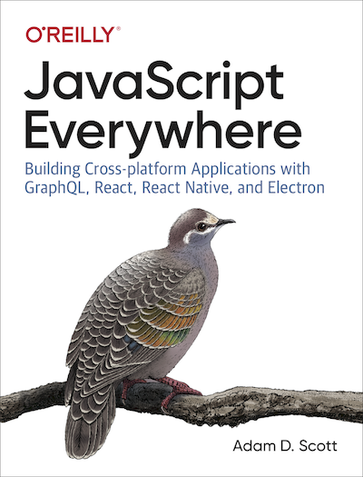

# JavaScript Everywhere API

This repository contains code examples for the API chapters of [_JavaScript Everywhere_](https://www.jseverywhere.io/) by Adam D. Scott, published by O'Reilly Media

## Getting Help

The best place to get help is our Spectrum channel, [spectrum.chat/jseverywhere](https://spectrum.chat/jseverywhere).

## Directory Structure

- `/src` If you are following along with the book, this is the directory where you should perform your development.
- `/solutions` This directory contains the solutions for each chapter. If you get stuck, these are available for you to consult.
- `/final` This directory contains the final working project

## To Use the Final Project Files

If you're developing a UI and would like to use the completed project, copy the files to the completed files to the `src` as follows: 

```
cp -rf ./final/* ./src/
```

## Seed Data

To seed data for local development: `npm run seed`. The password for all of the seeded users is `password`.

Each time this command is run, it will generate 10 users and 25 notes.

## Related Repositories

- [Web 💻 ](https://github.com/javascripteverywhere/web)
- [Mobile 🤳](https://github.com/javascripteverywhere/mobile)
- [Desktop 🖥️](https://github.com/javascripteverywhere/desktop)

## Code of Conduct

In the interest of fostering an open and welcoming environment, I pledge to making participation in our project and our community a harassment-free experience for everyone, regardless of age, body size, disability, ethnicity, sex characteristics, gender identity and expression, level of experience, education, socio-economic status, nationality, personal appearance, race, religion, or sexual identity and orientation..

This project pledges to follow the [Contributor's Covenant](http://contributor-covenant.org/version/1/4/).

## License

Copyright 2019 Adam D. Scott

Permission is hereby granted, free of charge, to any person obtaining a copy of this software and associated documentation files (the "Software"), to deal in the Software without restriction, including without limitation the rights to use, copy, modify, merge, publish, distribute, sublicense, and/or sell copies of the Software, and to permit persons to whom the Software is furnished to do so, subject to the following conditions:

The above copyright notice and this permission notice shall be included in all copies or substantial portions of the Software.

THE SOFTWARE IS PROVIDED "AS IS", WITHOUT WARRANTY OF ANY KIND, EXPRESS OR IMPLIED, INCLUDING BUT NOT LIMITED TO THE WARRANTIES OF MERCHANTABILITY, FITNESS FOR A PARTICULAR PURPOSE AND NONINFRINGEMENT. IN NO EVENT SHALL THE AUTHORS OR COPYRIGHT HOLDERS BE LIABLE FOR ANY CLAIM, DAMAGES OR OTHER LIABILITY, WHETHER IN AN ACTION OF CONTRACT, TORT OR OTHERWISE, ARISING FROM, OUT OF OR IN CONNECTION WITH THE SOFTWARE OR THE USE OR OTHER DEALINGS IN THE SOFTWARE.
